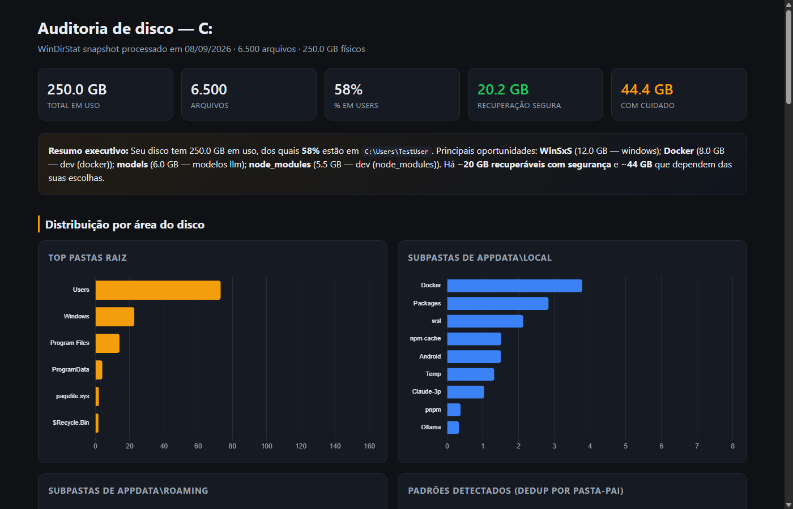
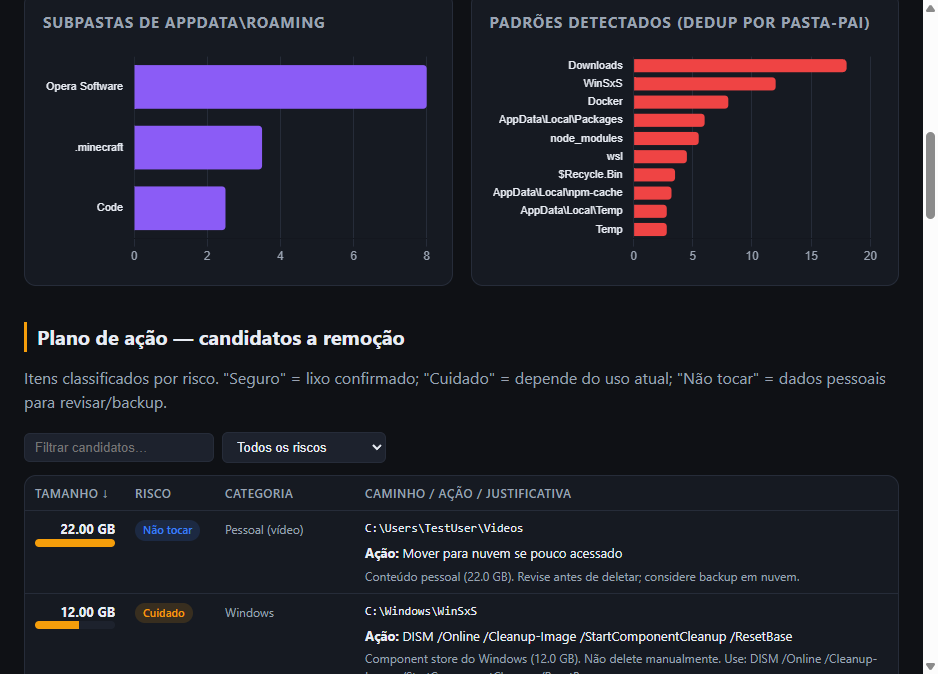
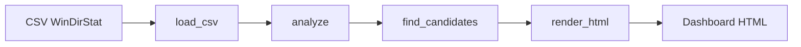

# Disk Audit

[](https://github.com/GuilhermeRoesler/DiskAudit/actions/workflows/ci.yml)
[](https://codecov.io/gh/GuilhermeRoesler/DiskAudit)
[](https://pypi.org/project/diskaudit/)
[](https://www.python.org/downloads/)
[](LICENSE)
[](https://guilhermeroesler.github.io/DiskAudit/)

> **EN:** Deterministic disk audit (no AI) from a [WinDirStat](https://windirstat.net/) CSV export. Produces an interactive HTML dashboard with risk-ranked cleanup candidates. UI and reports are in Brazilian Portuguese.

Auditoria de disco **determinística** (sem IA) a partir de export CSV do [WinDirStat](https://windirstat.net/). Gera um dashboard HTML interativo com KPIs, gráficos e um plano de ação classificado por risco — tudo em português.

**[Abrir demo ao vivo →](https://guilhermeroesler.github.io/DiskAudit/)** · [demo local](examples/demo_report.html) · [changelog](CHANGELOG.md)

> **Atenção:** a ferramenta apenas **recomenda** ações. Nenhum arquivo é deletado automaticamente.





## Resultado no fixture de demo

No CSV sintético (`tests/fixtures/sample.csv`, ~250 GB simulados), a análise encontra **~20 GB seguros** para limpeza, **~44 GB em “cuidado”** e **~43 GB “não tocar”** (dados pessoais/sistema) — com justificativa por item (Docker, WSL, modelos LLM, Android, caches, etc.).

## Por que este projeto

Disco cheio é um problema recorrente em máquinas de desenvolvimento (Docker, WSL, caches, `node_modules`, modelos LLM). Em vez de apagar “no feeling”, este projeto transforma um snapshot do WinDirStat em um **relatório acionável**: detecta candidatos, classifica risco e explica o porquê.

Demonstra:

- Pipeline de dados tipado (pandas + regras declarativas)
- Pacote Python instalável (`diskaudit`) com CLI
- UX de relatório (Chart.js, filtros, sort, empty states)
- Engenharia defensiva (validador de CSV, privacidade no `.gitignore`, testes + CI)

## Fluxo



## O que faz

- Lê um snapshot do WinDirStat e detecta automaticamente a unidade e o perfil de usuário
- Identifica candidatos a limpeza (Lixeira, Temp, caches, Docker, WSL, jogos, etc.)
- Classifica cada item em **Seguro**, **Cuidado** ou **Não tocar**
- Exibe distribuição por pastas raiz, AppData e padrões conhecidos
- Lista os maiores arquivos, idade por ano e top extensões

## Requisitos

- Python 3.10+
- [WinDirStat](https://windirstat.net/) para escanear o disco e exportar CSV
- Navegador moderno (o relatório embute Chart.js — funciona offline)

## Início rápido (Windows)

1. Escaneie a unidade no WinDirStat
2. Exporte: **File → Export → CSV** (UTF-8)
3. Salve como `disk.csv` na raiz deste projeto
4. Execute:

```bat
run.bat
```

O script instala dependências, gera `disk_report.html` e abre no navegador.

### Linha de comando

```bash
pip install -e .
# ou: pip install -r requirements.txt

python scripts/validate_csv.py disk.csv   # opcional, recomendado
python disk_audit.py disk.csv
# após install: disk-audit disk.csv
```

Abra `disk_report.html` manualmente se não usar `run.bat`.

### Instalar a partir do GitHub / PyPI

```bash
pip install diskaudit
# ou, a partir do código-fonte:
pip install "git+https://github.com/GuilhermeRoesler/DiskAudit.git"
disk-audit disk.csv
```

Releases publicadas com tags `v*` disparam o workflow de publicação no PyPI (Trusted Publishing).

## Uso avançado

```bash
# CSV e saída em caminhos customizados
python disk_audit.py "D:\exports\scan.csv" -o "D:\reports\auditoria.html"

# Template customizado (pasta com disk_dashboard_template.html)
python disk_audit.py disk.csv -t diskaudit/templates -o test_report.html

# Regenerar o demo do portfólio
python -m diskaudit.cli tests/fixtures/sample.csv -o examples/demo_report.html
```

| Argumento | Padrão | Descrição |
|-----------|--------|-----------|
| `csv` | `disk.csv` | Caminho do CSV exportado |
| `-o`, `--output` | `disk_report.html` | Arquivo HTML de saída |
| `-t`, `--template-dir` | `diskaudit/templates` | Pasta com `disk_dashboard_template.html` |

## Formato do CSV

O export deve conter estas colunas (nomes em português, como no WinDirStat pt-BR):

| Coluna | Descrição |
|--------|-----------|
| `Nome` | Caminho completo |
| `Arquivos` | Contagem de arquivos |
| `Subdiretórios` | Contagem de subpastas |
| `Tamanho Físico` | Bytes em disco (métrica principal) |
| `Tamanho Lógico` | Bytes lógicos |
| `Última Alteração` | Data de modificação |

Colunas extras (ex.: `Atributos`) são ignoradas.

## Validar CSV

```bash
python scripts/validate_csv.py disk.csv
```

Retorna exit code `0` se OK, `1` se inválido.

## Relatório gerado

| Seção | Conteúdo |
|-------|----------|
| KPIs | Total em uso, arquivos, % em Users, GB recuperáveis |
| Resumo executivo | Principais oportunidades em linguagem natural |
| Gráficos | Pastas raiz, AppData Local/Roaming, padrões detectados |
| Plano de ação | Candidatos filtráveis por risco, com ação e justificativa |
| Top arquivos | Maiores arquivos individuais |
| Idade por ano | Distribuição temporal dos arquivos |

**Ordem sugerida de limpeza:** candidatos **Seguro** → **Cuidado** (após confirmar que não usa) → revisar **Não tocar** manualmente.

## Testes e qualidade

```bash
pip install -e ".[dev]"

python -m unittest discover -s tests -v
ruff check .
mypy
coverage run -m unittest discover -s tests -v
coverage report
```

A CI no GitHub Actions roda lint (Ruff), type-check (mypy), coverage (Codecov) e testes em Python 3.10 / 3.12 / 3.13. Tags de release `v*` publicam no PyPI.

## Estrutura do projeto

```
diskaudit/                     # Pacote instalável
  analyze.py                   # CSV → métricas
  candidates.py / rules.py     # Plano de ação por risco
  rationales.py                # Justificativas
  render.py + templates/       # Dashboard HTML
  static/                      # Chart.js vendored
  cli.py                       # Entry point disk-audit
disk_audit.py                  # Shim de compatibilidade
scripts/validate_csv.py        # Validação do CSV
run.bat                        # Atalho Windows
examples/demo_report.html      # Demo anonymizada
docs/                          # Exemplos, referência e imagens
tests/                         # Unittest + fixture CSV
.github/workflows/             # CI + Pages + PyPI
```

Arquivos locais (não versionados): `disk.csv`, `disk_report.html`.

## Privacidade

O CSV e o relatório contêm caminhos e nomes de arquivos do seu sistema. Ambos estão no `.gitignore` — **não faça commit** desses arquivos. O demo em `examples/` usa apenas dados sintéticos (`TestUser`).

## Documentação

- [docs/examples.md](docs/examples.md) — fluxos, extensão de regras, troubleshooting
- [docs/reference.md](docs/reference.md) — regras, padrões e rationales
- [examples/README.md](examples/README.md) — como regenerar o demo
- [CHANGELOG.md](CHANGELOG.md) — histórico de versões
- [CONTRIBUTING.md](CONTRIBUTING.md) — como contribuir
- [SECURITY.md](SECURITY.md) — relatório de vulnerabilidades
- [CODE_OF_CONDUCT.md](CODE_OF_CONDUCT.md) — código de conduta

## Licença

[MIT](LICENSE) © Guilherme Roesler
